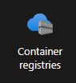

# Assignment: Permissions and Identity Management

#### **Objective**
This assignment is designed to introduce you to Identity Managament and IAM Roles, covering the setup of a WebApp and a Container Registry (ACR), configuration, and basic management of apps' identity and roles to connect both services. By the end of this assignment, you will understand how to connect at least two Azure services to allow them to communicate.

---

### **Task 1: Deploy a simple WebApp from Docker image**

#### 1. **Log in to Azure**
Navigate to your Azure portal and login.

#### 2. **Create a resource group**
Name your resource group `simpleAppRG`

#### 3. **Create a WebApp**

Go to App Services and create a new Web app. Set the following configurations:

* Choose the same resource group as previously.
* Name your web app: `simple-app`.
* Publish: ``Container``.
* Operating System: Linux.
* Region: France Central.
* Pricing Plan: Choose Free F1.

Go to the Next step, configure the container:
* Set "Image Source" to `Quickstart` (default option).
* Click on `Review + create, then "create".

**Question:** Wait few minutes then visit the URL of your WebApp, what do you see? Check the logs in the Deployment center to inspect what happened.


#### 4. **Create a Container Registry**
Look for Container Registries service and create a new Registry.



Use the following configuration:

* Selected the resource group you just created.
* Name the registry: `appsRegistry`.
* Location: France Central.
* Pricing plan : Standard.
* Click on `Review + create` and create your registry.

**Question:** What's a container registry?

#### 5. **Create a simple app**

First, let's create a simple app. On your computer:

* Create a new directory for your FastAPI app:
```bash
mkdir ~/simple-app
cd ~/simple-app
```
* Create a file named `main.py` with the following FastAPI code:
```python
from fastapi import FastAPI

app = FastAPI()

@app.get("/")
async def root():
    return {"message": "Hello, Azure!"}
```
Feel free to update this app! Show me your creativity :) 

* Create the ``Dockerfile``. In the `simple-app` directory, create a file named `Dockerfile` with the following content:
```Dockerfile
# Use an official Python runtime as a parent image
FROM python:3.9

# Set the working directory
WORKDIR /app

# Copy the current directory contents into the container at /app
COPY . /app

# Install FastAPI and Uvicorn
RUN pip install fastapi uvicorn

# Make port 8080 available to the world outside this container
EXPOSE 8080

# Run app with Uvicorn on container startup
CMD ["uvicorn", "main:app", "--host", "0.0.0.0", "--port", "8080"]
```
* Build the Docker image:
```bash
docker build -t fastapi-app .
```
* Run the Docker container:
```bash
docker run -d -p 8080:8080 fastapi-app
```
* Visit your website at http://localhost:8080.

#### 6. **Push the image to the registry**

Navigate to your ``appsRegistry`` resource. In "Overview", look for "Get Started" -> "Push an image".
Follow the steps to understand the example. After the step 4, navigate to "Repositories", what do you see?

Now using the same steps to push your local Docker image to your ACR registry. Push the image to `simpleApp` repository.

**Questions:** Why did you have to run `az acr login` command? What does the step 3 do? What about step 4?


#### 7. **Create an Identity for your WebApp**
You need to allow your WebApp to pull images from ACR in order to deploy it.

* Navigate to your WebApp. Look for ``Identity``.
* Enable "System Identity", then click on Save. 

**Questions:** 
* What's a "Service Principal"? How does it work?
* What's a "Managed Identity"?
* What's the difference between ``System Identity`` and ``User Identity`` in "Managed Identity"?
* What's the difference between "Managed Identity" and "Service Principal"?
* When clicking on "Azure role assignments", what so you see? What does this section list?

#### 8. **Assign roles to your WebApp**
Your WebApp doesn't have any role assignment for the moment, so technically, it can't access anything.

The WebApp needs access to ACR to pull the latest image of the app you pushed and deploy it. Let's grant it the permission:

* Navigate to your ``appRegistry`` and look for "Access Control (IAM)".
* Look for "Grant access to this resource" and click on "Add role assignment".
* You should see a list of roles, select ``AcrPull`` and click on Next.
* Keep "Assigned access to" to "Managed Identity", then click on "+ Select memebers".
* Set "Managed Identity" to "App Service", then look for your app by its name in the search bar, select it.
* Click on "Review + assign".

**Note:** A rule to always have in mind when you use the cloud: always give users and applications the least privileges. It is for security reasons, the less you open your gates the safer it is.

**Questions:** Go back to your WebApp and check "Azure role assignments" again, what do you see?


#### 9. **Make the Webapp deploy the image from the registry**

All permissions granted, now make the WebApp deploy the image you just pushed to the registry.

* Go back to yoru WebApp and go to Deployment Center settings.
* Change the "Registry source" to "Azure container Registry".
* Set "Authentication" to "Managed Identity".
* Change "Identity" to "System assigned".
* Set the registry to `appRegistry`.
* Set the image name to `simpleApp`.
* Set the version to `latest`.
* Save the settings of your WebApp.

Wait few minutes and visit the URL of your WebApp, you may need to restrat the app.

**Question:** What did you understand from this assignment?


### **Task 2: Deploy your Website using Containers**

Use the website you developed in previous assignments to create a Docker image and push it to ACR. Then, deploy the app to a WebApp (as in Task 1). 

Try to give a unique name for yoru WebAppp anddeactivate the `Unique default hostname (preview) on` option (e.g., you can try: <name_oo_your_app>_your_name).  

Once deployed, ask your classmate to visit your website!


### Troubleshooting:
- **Image Pull Errors**: Make sure the `az acr login` command was successful.
- **Access Denied**: Ensure the credentials provided to the web app are correct, and you have assigned the `acrpull` role to the service principal.
- **Web App Not Starting**: Use the Azure Portal to check the web app's logs for more information or run `az webapp log tail` to see real-time logs.


<!-- 
### **Task 3: Deploy a simple WebApp with CLI**

#### 1. **Login into Azure**
Open a terminal and log in into your Azure account.

#### 2. **Connect to your ACR**
First, log in to your ACR to ensure you have the right access:
```bash
az acr login --name <ACR_NAME>
```
Replace `<ACR_NAME>` with the name of your Azure Container Registry.

#### 3. **Create a Resource Group (if not created)**
You need a resource group to hold the web app:
```bash
az group create --name <RESOURCE_GROUP_NAME> --location <LOCATION>
```
Replace `<RESOURCE_GROUP_NAME>` with your desired resource group name (e.g., `myResourceGroup`), and `<LOCATION>` with the Azure region (e.g., `eastus`).

#### 4. **Create an Azure App Service Plan**
An App Service Plan defines the region, scale, and pricing tier for the web app:
```bash
az appservice plan create --name <APP_SERVICE_PLAN_NAME> --resource-group <RESOURCE_GROUP_NAME> --sku B1 --is-linux
```
- `<APP_SERVICE_PLAN_NAME>`: Name for the App Service Plan.
- `--sku B1`: The pricing tier. You can adjust this based on your needs (e.g., F1 for free tier).
- `--is-linux`: Specifies that you are using a Linux-based environment.

#### 5. **Create a Web App using the Docker Image**
Now, create a web app that will use the Docker image stored in your ACR:
```bash
az webapp create --resource-group <RESOURCE_GROUP_NAME> --plan <APP_SERVICE_PLAN_NAME> --name <WEB_APP_NAME> --deployment-container-image-name <ACR_NAME>.azurecr.io/<IMAGE_NAME>:<TAG>
```
- `<WEB_APP_NAME>`: Unique name for your web app (e.g., `mywebapp123`).
- `<IMAGE_NAME>`: Name of your Docker image.
- `<TAG>`: Image tag (e.g., `latest`).

#### 6. **Configure Web App to Authenticate with ACR**
If your ACR is private (which is usually the case), you need to provide your web app with permission to pull the image from ACR:

a) **Create a Service Principal** and grant it access to your ACR:
```bash
az ad sp create-for-rbac --name http://<WEB_APP_NAME> --scopes $(az acr show --name <ACR_NAME> --query id --output tsv) --role acrpull --sdk-auth
```
This command returns a JSON object. Save this JSON as you might need it for troubleshooting or later steps.

b) **Configure the Web App** to use ACR credentials:
```bash
az webapp config container set --name <WEB_APP_NAME> --resource-group <RESOURCE_GROUP_NAME> --docker-custom-image-name <ACR_NAME>.azurecr.io/<IMAGE_NAME>:<TAG> --docker-registry-server-url https://<ACR_NAME>.azurecr.io --docker-registry-server-user <CLIENT_ID> --docker-registry-server-password <CLIENT_SECRET>
```
- `<CLIENT_ID>` and `<CLIENT_SECRET>` are from the JSON response you got from the previous step.

#### 7. **Set Environment Variables (Optional)**
If your web app requires any environment variables, set them using:
```bash
az webapp config appsettings set --resource-group <RESOURCE_GROUP_NAME> --name <WEB_APP_NAME> --settings ENV_VAR1=value1 ENV_VAR2=value2
```

#### 8. **Verify Deployment**
To verify that your app is running, you can browse to:
```
https://<WEB_APP_NAME>.azurewebsites.net
```

#### 9. **Monitor Logs (Optional)**
To view the logs from your running web app:
```bash
az webapp log tail --name <WEB_APP_NAME> --resource-group <RESOURCE_GROUP_NAME>
```

### Additional Tips:
- If you need Continuous Deployment from ACR to your web app, you can set it up using the Azure Portal or Azure CLI.
- You can scale the web app by modifying the App Service Plan settings.

### Troubleshooting:
- **Image Pull Errors**: Make sure the `az acr login` command was successful and the service principal has the correct permissions.
- **Access Denied**: Ensure the credentials provided to the web app are correct, and you have assigned the `acrpull` role to the service principal.
- **Web App Not Starting**: Use the Azure Portal to check the web app's logs for more information or run `az webapp log tail` to see real-time logs.

Let me know if you need help with any specific part! -->